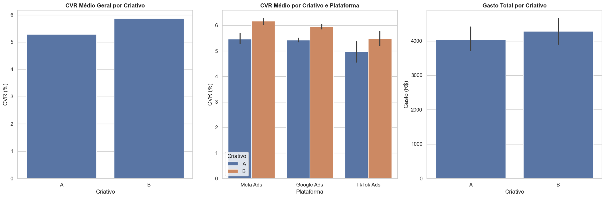

# Teste AB - Redes Sociais

# DOCUMENTAÇÃO

- **Informações Gerais**
    - **Título do Dataset:** dataset_teste_AB.csv
    - **Criador:** Gerado com IA.
    - **Período dos Dados:** 25 de agosto de 2025 a 30 de agosto de 2025
    - **Fonte:** Dados sintéticos simulando a performance de anúncios em plataformas digitais.

- **Título e Objetivo da Análise:**
    - Este dataset foi criado para simular o desempenho de um teste A/B entre dois criativos (`Criativo A` e `Criativo B`) em diferentes plataformas de mídia digital. O objetivo primário é permitir a análise comparativa das métricas de performance para determinar a eficácia de cada criativo e a relevância estatística de suas diferenças.

- **Dicionário de Variáveis (Colunas)**

| Coluna | Tipo de Dado | Descrição |
| --- | --- | --- |
| `Data` | `Date` | O dia em que os dados de desempenho foram coletados. |
| `Plataforma` | `String` | O canal de mídia digital no qual o criativo foi veiculado. |
| `Criativo` | `String` | A versão do anúncio testado (A ou B). |
| `Impressões` | `Integer` | O número total de vezes que o anúncio foi exibido. |
| `Cliques` | `Integer` | O número total de cliques no anúncio. |
| `Conversões` | `Integer` | A contagem do evento de conversão, representando a meta de negócio (ex: compras, cadastros). |
| `Gasto (R$)` | `Float` | O custo total gasto com o anúncio para aquele dia e criativo. |
- **Dicionário de Dimensões (Valores das Linhas)**

| Dimensão | Valores Únicos | Descrição Detalhada |
| --- | --- | --- |
| **`Plataforma`** | Meta Ads | Dados de performance de anúncios veiculados nas plataformas do Meta (Facebook e Instagram). |
| **`Plataforma`** | Google Ads | Dados de performance de anúncios veiculados na rede de anúncios do Google. |
| **`Plataforma`** | TikTok Ads | Dados de performance de anúncios veiculados na plataforma do TikTok. |
| **`Criativo`** | A | Versão de **controle** do anúncio para o teste A/B. Representa a linha de base para a comparação. |
| **`Criativo`** | B | Versão **variante** do anúncio para o teste A/B. Seu desempenho será comparado ao do `Criativo A`. |

---

# CARREGAMENTO E VERIFICAÇÃO DOS DADOS

- Por ter sido um dataset pequeno gerado por IA a mérito de experimento, ele foi imputado diretamente no script em python.

# ANÁLISE EXPLORATÓRIA

### **Comparativo de Desempenho de criativo entre diferentes plataformas.**

- **Hipótese:** Criativo B com maior apelo devido a troca de CTA.
- **Gráfico & Tabela:**

Desempenho agregado por Plataforma e Criativo:

| Plataforma | Criativo | Impressões | Cliques | Conversões | Gasto (R$) |
| --- | --- | --- | --- | --- | --- |
| Google Ads | A | 53500 | 1750 | 95 | 1275 |
| Google Ads | B | 55900 | 1960 | 117 | 1340 |
| Meta Ads | A | 77200 | 2310 | 126 | 1610 |
| Meta Ads | B | 80300 | 2730 | 169 | 1700 |
| TikTok Ads | A | 45600 | 1350 | 68 | 1160 |
| TikTok Ads | B | 48000 | 1650 | 91 | 1245 |

| Plataforma | Criativo | CTR_medio | CVR_medio |
| --- | --- | --- | --- |
| Google Ads | A | 3.27 | 5.43 |
| Google Ads | B | 3.51 | 5.97 |
| Meta Ads | A | 2.99 | 5.45 |
| Meta Ads | B | 3.40 | 6.19 |
| TikTok Ads | A | 2.96 | 5.04 |
| TikTok Ads | B | 3.44 | 5.52 |

 

- **Insight:** A análise exploratória aponta para uma maior taxa de conversão para o criativo B, embora ele também apresente um investimento um pouco maior que o criativo A.

# Análise Estatística: Teste T

- **P-Valor (0.0001)** - É a principal evidência que nos diz a probabilidade de a diferença de CVR entre criativos ter ocorrido puramente por acaso. Se o P-valor for menor que 0.05 é uma prova que a diferença é estatisticamente significante. Neste caso, isso significa que a chance de a superioridade do Criativo B ser apenas sorte é de 0.01%, logo a diferença é real, e não um acidente.

- Estatística T (-4.3375): Mede a força da evidência e mede o quão forte é a diferença entre as médias dos dois grupos, considerando a variação nos dados.
    - Quanto maior o valor absoluto (mais longe do zero), mais forte é a evidência da diferença entre os dois criativos analisados.
    - O sinal de negativo (-) indica que a média

# Conclusão

Como conclusão tempos a recomendação de alocação total de verba para a opção B durante o período restante da campanha uma vez que a taxa de conversão do criativo B apresentou uma taxa de 11,6% superior a opção A.
